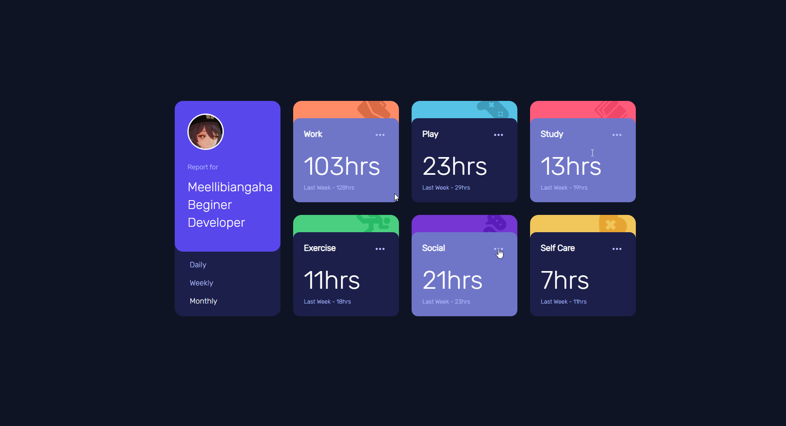

##  Ваши пользователи должны уметь: ##

- Просмотр оптимального макета сайта в зависимости от размера экрана устройства. (нет)  
- Просматривайте состояния наведения для всех интерактивных элементов на странице (да)  
- Переключение между просмотром статистики за день, неделю и месяц (да)  
***
#  Процесс #  

Изучил для себя новую тему в css -> grid'ы, попытался поработать с кнопками на js'е.  

- Html (div'ы)
- Css (использования grid'ов)
- JavaScript без библиотек (хочу для начала опробовать обычный js)  
*** 

##  Результат ##  
  
  
  
 
*** 

##  Полезные ссылки ##  

1. [Css](https://html5book.ru/css-grid/)  
2. [Js](https://developer.mozilla.org/ru/)  
3. [Вопросы по json'у](https://ru.stackoverflow.com/)  
4. [Task](https://www.frontendmentor.io/challenges)  